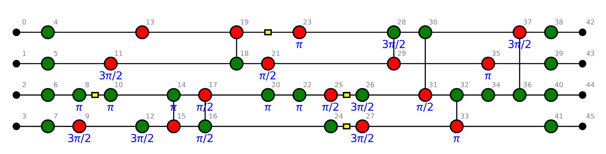
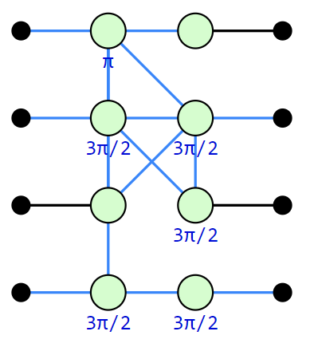

Getting Started
===============

.. _gettingstarted:

The best way to get started is to run the `Getting Started Notebook <_static/gettingstarted.ipynb>`_ in Jupyter. If you don't have Jupyter: this document contains the same information.

With PyZX you can create and simplify quantum circuits. Start by importing the library::
	
	>>> import pyzx as zx

Then you can get a randomly generated Clifford circuit::
	
	>>> circuit = zx.cliffords(5, 10)

Here ``5`` is the number of qubits the circuit acts on, and ``10`` is the depth of the generated circuit. We can visualise the circuit::
	
	>>> zx.draw(circuit)

We can also reduce the circuit using the rules from ZX-calculus::
	
	>>> zx.clifford_simp(circuit)  # simplifies the circuit
	>>> zx.drawing.pack_circuit_nf(circuit,'gslc')  # makes it more presentable
	>>> zx.draw(circuit)

   The same circuit, but rewritten into a more compact form.

The circuit is represented internally as a graph::
	
	>>> print(circuit)
	Graph(40 vertices, 38 edges)

