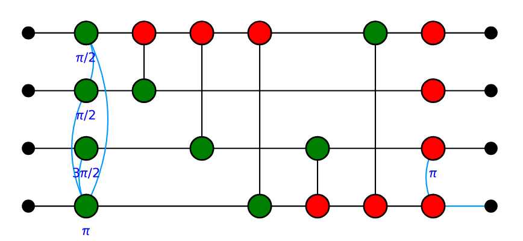

Getting Started
===============

.. _gettingstarted:

The best way to get started if you have cloned the repository is to run the `Getting Started notebook <https://github.com/Quantomatic/pyzx/blob/master/demos/gettingstarted.ipynb>`_ in Jupyter. If you have a Microsoft account, then you can use Azure to run `this notebook <https://notebooks.azure.com/johnie102/libraries/pyzx/html/demos/gettingstarted.ipynb>`_ in your browser without having downloaded PyZX. If you don't want to follow those routes: this document contains the same general information.

With PyZX you can create and simplify quantum circuits. Start by importing the library::
	
	>>> import pyzx as zx

Then you can get a randomly generated Clifford circuit::
	
	>>> circuit = zx.generate.cliffords(5, 15)

Here ``5`` is the number of qubits the circuit acts on, and ``15`` is the depth of the generated circuit. We can visualise the circuit::
	
	>>> zx.draw(circuit)

.. figure::  _static/clifford.png
   :align:   center

We can also reduce the circuit using the rules from ZX-calculus::
	
	>>> g = circuit.copy()
	>>> zx.simplify.clifford_simp(g)  # simplifies the circuit
	>>> g.normalise()  # makes it more presentable
	>>> zx.draw(g)

.. figure::  _static/clifford_simp.png
   :align:   center

   The same circuit, but rewritten into a more compact form. The blue lines represent edges which have a Hadamard gate on them.

The circuit is represented internally as a graph::
	
	>>> print(g)
	Graph(16 vertices, 21 edges)

This simplified ZX-graph no longer looks like a circuit. PyZX supplies some methods for turning a ZX-graph back into a circuit::
	
	>>> zx.extract.clifford_extract(g,1,2)
	>>> zx.draw(g)

To verify that the simplified circuit is still equal to the original we can convert them to numpy tensors and compare equality directly::
	
	>>> t1 = circuit.to_tensor()
	>>> t2 = g.to_tensor()
	>>> zx.compare_tensors(t1,t2)
		True

The circuit-like ZX-graph ``g`` can also be concretely represented as a circuit::
	
	>>> c = zx.Circuit.from_graph(g)
	>>> print(c.gates)
		[S(1), S*(2), Z(3), CZ(1,3), CZ(2,3), S(0), CZ(1,0), CZ(3,0), CNOT(1,0), CNOT(2,0), CNOT(3,0), CNOT(2,3), CNOT(0,3), NOT(2), CX(2,3), HAD(3)]

And we can represent this circuit in one of several circuit description languages, such as that of QUIPPER::
	
	>>> print(c.to_quipper())
	Inputs: 0Qbit, 1Qbit, 2Qbit, 3Qbit
	QGate["S"](1) with nocontrol
	QGate["S"]*(2) with nocontrol
	QGate["Z"](3) with nocontrol
	QGate["Z"](3) with controls=[+1] with nocontrol
	QGate["Z"](3) with controls=[+2] with nocontrol
	QGate["S"](0) with nocontrol
	QGate["Z"](0) with controls=[+1] with nocontrol
	QGate["Z"](0) with controls=[+3] with nocontrol
	QGate["not"](0) with controls=[+1] with nocontrol
	QGate["not"](0) with controls=[+2] with nocontrol
	QGate["not"](0) with controls=[+3] with nocontrol
	QGate["not"](3) with controls=[+2] with nocontrol
	QGate["not"](3) with controls=[+0] with nocontrol
	QGate["not"](2) with nocontrol
	QGate["X"](3) with controls=[+2] with nocontrol
	QGate["H"](3) with nocontrol
	Outputs: 0Qbit, 1Qbit, 2Qbit, 3Qbit

This concludes this tutorial. For more information about the simplification procedures see :ref:`simplify`. Information regarding the circuit extraction can be found in :ref:`extract`. The different representations of the graphs and circuits is detailed in :ref:`representations`. The low level graph api is explained in :ref:`graph`.