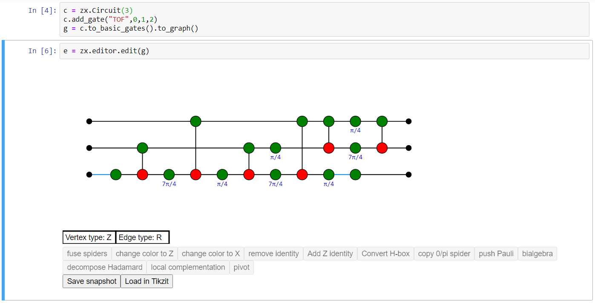

.. _graphs:

ZX-diagrams in PyZX and how to modify them
==========================================

ZX-diagrams are represented in PyZX by instances of the ``BaseGraph`` class, and are stored as simple graphs with some additional data on the vertices and edges. There are 4 different types of vertices: boundaries, Z-spiders, X-spiders and H-boxes. Boundary vertices represent an input or an output to the circuit and carry no further information. Z- and X-spider are the usual bread and butter of ZX-diagrams. H-boxes are used in ZH-diagrams as a generalisation of the Hadamard gate. Non-boundary vertices carry additional information in the form of a `phase`. This is a fraction ``q`` representing a phase ``pi*q``.

As a simple example, we could have a graph with 3 vertices. The first being a boundary acting as input, the last being a boundary acting as output. If the middle one is a Z-vertex with phase ``a`` that is connected to both the input and output, then this graph represents a Z[``pi*a``]-phase gate.

Edges in a PyZX graph come in two flavors. The first is the default edge type which represents a regular connection. The second is a `Hadamard-edge`. This represents a connection between vertices with a Hadamard gate applied between them, and in the drawing functions of PyZX is represented by a blue edge.

Accessing and setting vertex and edge type
------------------------------------------

The type of a vertex ``v`` in a graph ``g`` can be retrieved by ``g.type(v)``. This returns an integer representing the type. These integers are stored in :class:`pyzx.utils.VertexType` and is one of the following:

- ``VertexType.BOUNDARY``
- ``VertexType.Z``
- ``VertexType.X``
- ``VertexType.H_BOX``

To get the type of all the vertices at once you call ``g.types()``. This returns a dictionary-like object that maps vertices to their types. So for instance one can do the following::
	
	ty = g.types()
	if ty[vertex] == VertexType.BOUNDARY:
		#It is a boundary

Similarly, the type of an edge is stored as one of the integers ``EdgeType.SIMPLE`` or ``EdgeType.HADAMARD``, where ``EdgeType`` can be found as :class:`pyzx.utils.EdgeType`. The edge type of a given edge can be retrieved by ``g.edge_type(edge)``.

.. _graph_api:

Backends
--------

ZX-graphs can be represented internally in different ways. The only fully functioning backend right now is :class:`pyzx.graph.graph_s.GraphS`, which is written entirely in Python. A partial implementation using the ``python-igraph`` package is also available as :class:`pyzx.graph.graph_ig.GraphIG`. A new backend can be constructed by subclassing :class:`pyzx.graph.base.BaseGraph`.

Creating and modifying ZX-diagrams
----------------------------------

To create an empty ZX-diagram call ``g=zx.Graph()``. 
You can then add a vertex and set its data by calling for example ``v = g.add_vertex(zx.VertexType.Z, qubit=0, row=1, phase=1)``. To add an edge between vertices ``v`` and ``w`` you call ``g.add_edge(g.edge(v,w),edgetype=zx.EdgeType.SIMPLE)``.

These functions are probably best used in some type of loop or function so that you don't have to set everything by hand. If you wish to create a ZX-diagram in the shape of a circuit it is probably better to use the :class:`~pyzx.circuit.Circuit`, or if you don't care about the exact structure of the circuit, one of the functions in :mod:`~pyzx.generate`.

The ZX-diagram editor
---------------------

.. warning::
	The newer JupyterLab as opposed to the older Jupyter Notebook uses a different framework for widgets which is currently not compatible with the widgets used in PyZX. For the editor to work you therefore must use the classic notebook interface. If you are using JupyterLab you can find this interface by going to 'Help -> Launch Classic Notebook'. In addition, versions ``ipywidgets>=8`` and ``notebook>=6.5`` break the editor widget. The latest versions known to work is ``ipywidgets==7.7.1`` and ``notebook==6.4.12``.

.. warning::
	The current PyZX version does not include this restriction on the versions of ``ipywidgets`` and ``notebook`` to increase compatibility with other libraries, so if you want to use the editor, you have to manually make sure you have the correct version of these libraries. There is no further development on the editor, so you can consider it deprecated. If you want to have a nice ZX-diagram editor that is compatible with PyZX, consider using ZXLive.

If you are using a Jupyter notebook, probably the best way to build an arbitrarily shaped ZX-diagram in PyZX is to use the built-in graphical editor. If you don't mind using additional libraries: see the information on ZXLive below.
If you have a ZX-diagram ``g``, call ``e = zx.editor.edit(g)`` to start a new editor instance. The output of the cell should be the editor, and should look something like this:

Ctrl-clicking (Command-clicking for Mac users) on the view of the graph will add a new vertex of the type specified by 'Vertex type' (so a Z-vertex in the above example). Click 'Vertex type' to change the type of vertex to be added, or with the editor window selected, use the hotkey 'X'.

Ctrl-drag (Command-drag) between two vertices to add a new edge of the type 'Edge type' (either Regular or Hadamard), or use the hotkey 'E' to switch. Adding an edge between vertices where there is already one present replaces the edge with the new one.

Drag a box around vertices to select them. With a set selected, drag your mouse on one of the vertices to move them. Press delete or backspace to delete your selection. You can also directly select an edge by clicking it.

Pressing Ctrl+C while having a selection copies your selection to the clipboard as tikz code that can be directly pasted into Tikzit. Pressing Ctrl+V pastes a diagram specified by tikz code into the diagram.

Double-click a vertex to change its phase. You should enter a fraction possibly followed by pi. Example inputs: '1', '-1/2', '3/2pi'. An empty input gives the default value ('0' for Z/X spiders, '1' for H-boxes).

Any change can be undone by pressing Ctrl-Z, and redone by pressing Ctrl-Shift-Z.

Changes in the editor are automatically pushed to the underlying graph. So if we made the editor using the command ``e = zx.editor.edit(g)`` than any changes we make are automatically done to ``g``. Alternatively, we can access the graph by ``e.graph``. Outside of the editor we can also make changes to ``g``. For instance, we can call ``zx.spider_simp(g)`` to fuse all the spiders in ``g``. To view these changes in the editor, call ``e.update()``.

With a set of vertices selected, you will see some of the buttons beneath the editor light up. Clicking these buttons will do the action it says on the graph. Each of these actions will preserve the semantics of your ZX-diagram (i.e. the linear map it implements).

Sometimes it is useful to see which linear map your ZX-diagram implements. If you create the editor with the command ``e = zx.editor.edit(g,show_matrix=True)``, this will show a Latex-styled matrix beneath the editor with the linear map your ZX-diagram implements. This matrix is automatically updated after every change you make to the graph. Note that this only works if your ZX-diagram does not have too many inputs and outputs (at most 4). It automatically regards boundary vertices 'pointing right' as inputs, and boundary vertices 'pointing left' as outputs. You can change this manually by changing ``g.inputs`` and ``g.outputs``.

If you click 'Save snapshot', a copy of the graph is saved in the list ``e.snapshots``. When you press 'Load in Tikzit', all snapshots are loaded into a Tikz format parseable by `Tikzit <https://tikzit.github.io>`_. In order to use this functionality you have to point ``zx.settings.tikzit_location`` to a valid executable.

ZXLive
----------

`ZXLive <https://github.com/zxcalc/zxlive>`_ (see also the documentation `here <https://zxlive.readthedocs.io/en/latest/gettingstarted.html>`_) is a graphical user interface for constructing ZX-diagrams and doing automated rewriting with them that is built on top of PyZX. The interface is inspired by `Tikzit <https://tikzit.github.io>`_ so if you are familiar with that, it should be easy enough to use.

ZXLive is built using Qt, and this supplies a magic Jupyter command to open the app from the notebook, which allows you to dynamically interact with that. To see how this works, add the following cell to a Jupyter notebook with ZXLive installed::

	%gui qt6
	from zxlive import app
	g =  zx.Graph()
	g.add_vertex(zx.VertexType.Z, 0, 0)
	g.add_vertex(zx.VertexType.X, 0, 1)
	g.add_edge((0, 1))
	zx.draw(g)

	zxl = app.get_embedded_app()
	zxl.edit_graph(g, 'g1')
	zxl.edit_graph(g, 'g2') # You can open multiple copies of the same graph into separate tabs

Any changes made in the ZXLive graphs are not immediately updated in PyZX. Instead you must extract a copy from ZXLive using ``zxl.get_copy_of_graph('graphname')``.