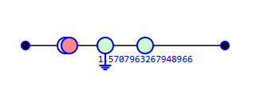
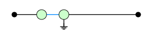

.. _pyzx_grounding_example:

Hybrid Quantum-Classical Circuit
================================

This example illustrates how **PyZX**'s ``ground`` mechanism can model hybrid quantum-classical circuits by treating measurement outcomes as classical data within ZX-diagrams.

Overview
--------

This demonstration involves the application of a Hadamard gate using ZX-spiders connected by a Hadamard edge. A Z-basis measurement is then performed, and the corresponding vertex is grounded to indicate the conversion of quantum information into classical form. Following the measurement, a classically controlled gate is inserted, conditioned on the measurement outcome. Finally, the circuit is simplified using ``zx.simplify.full_reduce``, which recognizes grounded vertices and applies classical optimization rules accordingly.

.. note::

   In PyZX, grounding a vertex marks it as measured. This allows the simplification engine to apply classical reasoning rules to that portion of the graph.

Getting Started
---------------

Install PyZX using pip::

    pip install pyzx

Importing the necessary libraries::

    >>> import pyzx as zx
    >>> from pyzx.graph.base import BaseGraph
    >>> from pyzx.graph.graph_s import GraphS
    >>> from pyzx.graph import VertexType, EdgeType
    >>> import math

Circuit Construction
--------------------

Create the ZX-graph, add boundary vertices, model a Hadamard gate, and perform a Z-basis measurement::

    >>> g = GraphS()
    >>> in0 = g.add_vertex(VertexType.BOUNDARY, qubit=0, row=0)
    >>> out0 = g.add_vertex(VertexType.BOUNDARY, qubit=0, row=5)
    >>> g.set_inputs([in0])
    >>> g.set_outputs([out0])

    >>> h_z = g.add_vertex(VertexType.Z, qubit=0, row=1, phase=0)
    >>> h_x = g.add_vertex(VertexType.X, qubit=0, row=1.1, phase=0)
    >>> g.add_edge((in0, h_z), EdgeType.SIMPLE)
    >>> g.add_edge((h_z, h_x), EdgeType.HADAMARD)
    >>> q_curr = h_x

    >>> meas_q0 = g.add_vertex(VertexType.Z, qubit=0, row=2)
    >>> g.add_edge((q_curr, meas_q0), EdgeType.SIMPLE)
    >>> g.set_ground(meas_q0, True)

Classical Control and Simplification
------------------------------------

Add a classically controlled Z-rotation and simplify the graph::

    >>> controlled_op = g.add_vertex(VertexType.Z, qubit=0, row=3, phase=math.pi / 2)
    >>> g.add_edge((meas_q0, controlled_op), EdgeType.SIMPLE)
    >>> g.add_edge((controlled_op, out0), EdgeType.SIMPLE)

    >>> zx.draw(g)  # Visualization before simplification
    >>> zx.simplify.full_reduce(g)
    >>> zx.draw(g)  # Visualization after simplification

Visualizations
--------------

**Before Simplification:**

   Initial ZX diagram before applying simplification.

**After Simplification:**

   ZX diagram after applying ``zx.simplify.full_reduce``, respecting grounded classical information.

